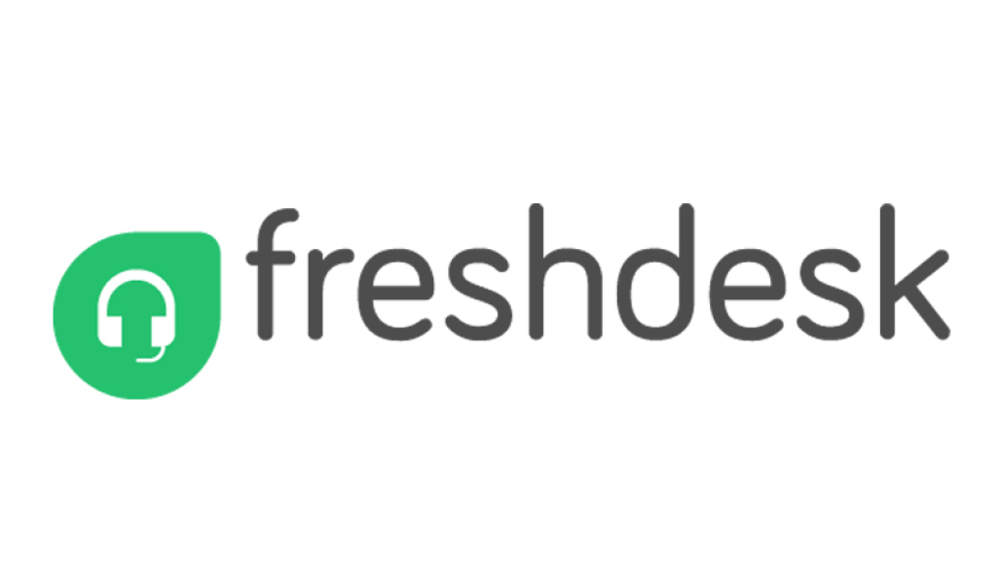

# Kosha Freshdesk Connector

Freshdesk is a cloud-based customer support platform that was founded with the mission of enabling companies of all sizes to provide great customer service.

The connector APIs allow you to perform 'RESTful' operations such as reading, modifying, adding or deleting data from your helpdesk. The APIs also support Cross-Origin Resource Sharing (CORS).




This Connector API exposes REST API endpoints to perform any operations on Freshdesk v2 API in a simple, quick and intuitive fashion.

It describes various API operations, related request and response structures, and error codes.

## Build

To build the project binary, run
```
    go build -o main .

```

## Run locally

To run the project, simply provide env variables to supply the API key and Freshdesk domain name.


```bash
go build -o main .
API_KEY=<API_KEY> DOMAIN_NAME=<DOMAIN_NAME> ./main
```

This will start a worker and expose the API on port `8005` on the host machine

Swagger docs is available at `https://localhost:8005/docs`

## Generating Swagger Documentation

To generate `swagger.json` and `swagger.yaml` files based on the API documentation, simple run -

```bash
go install github.com/swaggo/swag/cmd/swag@latest
swag init -g main.go --parseDependency --parseInternal
```

To generate OpenAPISpec version 3 from Swagger 2.0 specification, run -

```bash
npm i api-spec-converter
npx api-spec-converter --from=swagger_2 --to=openapi_3 --syntax=json ./docs/swagger.json > openapi.json
```
